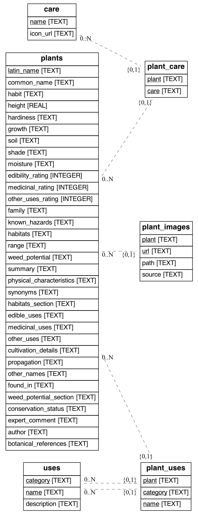

# Plants For A Future (PFAF) Data

Plant data scraped from the [PFAF website](https://pfaf.org/user/Default.aspx).

The data and images are subject to the copyright laid out in the [PFAF website](https://pfaf.org/user/cmspage.aspx?pageid=136).

## Files

- `main.py`: The main script to scrape all the data. Run with `python main.py`.
- `data.sqlite`: All the data about the plants.
- `images/`: All the plant images, downloadd. The sources are located in the `plant_images` table in the DB.



## Datasette

We use Datasette to create a website to display the data. To start it locally run:

```console
$ datasette data.sqlite -m metadata.json
```

We also [host a version on Heroku](https://pfaf-data.herokuapp.com/). To updated the hosted version run:

```console
$ python main.py publish
```

## Development

This project currently has support for setting up a local
development environment using Conda. See the [Conda install docs](https://docs.conda.io/en/latest/miniconda.html#)
for how to install Conda.

It also uses [Conda Lock](https://github.com/conda-incubator/conda-lock)
to create a locked down version of the dependencies for reproducibility.

You are also welcome to use any other way you prefer for developing Python packages.

```console
# To get get started:
$ conda create --name pfaf-data --file conda-[osx/linux/win]-64.lock
$ conda activate

# To regenerate the lockfiles:
$ conda-lock  --kind explicit
```
